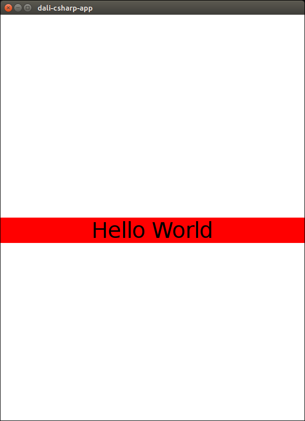

# NUI Hello World Tutorial

The tutorial shows how to create and display "Hello World" using a text label.

[The NUI Overview](NUIoverview.md) describes NUI capabilities in detail.

## Explanation of tutorial

The following steps are required to display text:

+ Initialise the NUI library
+ Create a View - a text label showing text
+ Add the text label to the application main window

This tutorial demonstrates the triggering (_firing_) of the the _Initialized_ and _Touch_ window application events.

### Main method

The Main method consists of 3 steps:

1. Creating application with the default constructor:

~~~{.cs}
Example example = new Example();
~~~

2. Adding initialization event handler to window application _Initialized_ event.

This event handler will set up the scene, and is triggered once only.

~~~{.cs}
example.Initialized += Initialize;
~~~

Adding the event handler with lambda expressions is demonstrated at the end of the tutorial.

3. Starting application main loop

The main loop must be started to run the application. This ensures that images are displayed,
and events and signals are dispatched and captured.

~~~{.cs}
example.Run(args);
~~~

In this simple tutorial, the Main method resides within the class. For significant application development place the Main
method in a seperate .cs file.

#### Creation

The application is derived from the Tizen NUI application class - _NUIApplication_

~~~{.cs}
class Example : NUIApplication
~~~

_The NUIApplication class includes constructors enabling application creation with stylesheets and window modes_.

### The Initialization event handler - Initialize()

The initialization code contains the following simple steps:

Creating the text label:

~~~{.cs}
TextLabel text = new TextLabel("Hello NUI World");
~~~

Positioning the text in centre of application window. The _ParentOrigin_ defines a point
within the parent views's area. Note: The text label will be at least the
width of the screen if the text label size is not specified.

~~~{.cs}
text.ParentOrigin = ParentOrigin.CenterLeft;
~~~

Alignment of text horizontally to the center of the available area:

~~~{.cs}
text.HorizontalAlignment = HorizontalAlignment.Center;
~~~

Setting label background color to illustrate label width:

~~~{.cs}
text.BackgroundColor = Color.Red;
~~~

Setting text size. The size of the font in points.

~~~{.cs}
text.PointSize = 32.0f;
~~~

Get main application window and add event handler to window _Touch_ event.
The event handler is invoked on any click in the application window.

~~~{.cs}
Window window = Window.Instance;
window.Touch += WindowTouched;
~~~

Adding text to default layer.

~~~{.cs}
window.Add(text);
~~~

### Touch event handler

Click anywhere in the application window to exit:

~~~{.cs}
private void WindowTouched(object sender, Window.TouchEventArgs e)
{
   example.Application.Quit();
}
~~~

### Compile the application

csc /DALi_toolkit.lib helloNUI.cs

### Starting the application

Start up a terminal, and type ./helloNUI

## Full example code

~~~{.cs}
namespace HelloTest
{
    class Example : NUIApplication
    {
        private void Initialize(object src, EventArgs e)
        {
            // Add a simple text label to the main window
            TextLabel text = new TextLabel("Hello NUI World");
            text.ParentOrigin = ParentOrigin.CenterLeft;
            text.HorizontalAlignment = HorizontalAlignment.Center;
	    text.BackgroundColor = Color.Red;
            text.PointSize = 32.0f;

            // Connect the signal callback for a touched signal
            Window window = Window.Instance;
            window.Touch += OnWindowTouched;

            window.Add(text);
        }

        // Callback for main window touched signal handling
        private void WindowTouched(object sender, Window.TouchEventArgs e)
        {
	    example.Application.Quit();
        }

        static void Main(string[] args)
        {
            Example example = new Example();
	    example.Initialized += Initialize;
            example.Run(args);
        }
    }
}
~~~

### Alternate method of adding the Initialzed event using lambda expression syntax

~~~{.cs}
static void Main(string[] args)
{
    Example example = new Example();
    example.Initialized += (object src, EventArgs args) =>
    { // Initialisation code
        .....
    };

    example.Run(args);
}
~~~

## Example output

After running the example, the following output should appear:

### More information on the Text label 

The [Text Label tutorial](text-label.md) describes the key properties of the text label in detail.

[Back to top](#0)

