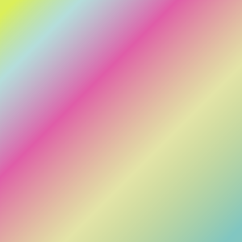
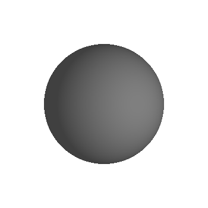
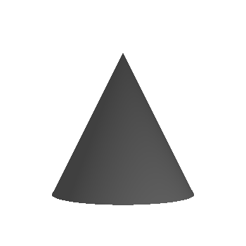
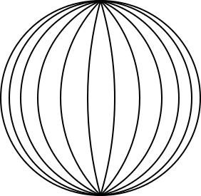
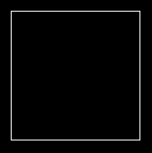

# Visuals Tutorial

In this tutorial:

[Overview](#overview) 
[Visual Properties](#visualproperties) 
[Visual Type](#visualtype) 
[Visual Creation and registration](#visualcreation) 
[Example of Visuals in use](#visualexample) 
[The Color Visual](#colorvisual) 
[The Gradient Visual](#gradientvisual) 
[The Image Visual](#imagevisual) 
[THe Border Visual](#bordervisual) 
[The Mesh visual](#meshvisual) 
[The Primitive Visual](#primitivevisual) 
[The Wireframe Visual](#wireframevisual) 
[The Text Visual](#textvisual) 
[The Visual transform](#visualtransform) 
[The Visual map class](#visualmap) 
[The Visual view class](#visualview) 

## Overview

Visuals provide reusable rendering logic.

Visuals are the main building block of controls. This means that custom controls can reuse existing visuals rather
than create them from scratch, which increases performance.
 
Visuals reuse geometry, shaders etc. across controls, and manage the renderer and texture existance when the control is on-stage.
Additionally visuals, respond to view size and color change, while also providing clipping at the renderer level.

Visuals are configured via Properties. 

To create a visual:
* Create a property map
* Add visual 'type' to property map (_must be first entry in property map_)
* Add required property values to the map
* Create visual using property map
* Register visual

### Example of Visuals in use - button styling

Images and icons are added to buttons using visuals.

A control has 3 states - NORMAL, FOCUSED and DISABLED. Buttons have sub states: SELECTED and UNSELECTED.
Each state and sub-state should have the required visuals. A visual can be common between states.

The button's appearance can be modified by setting properties for the various 'state' Visuals.

When pressed the unselected visuals are replaced by the selected visual.
 
When the button is disabled, background, button and selected visuals are replaced by
their disabled visuals.

The [styling tutorial](../NUItutorials/styling.md) explains how to build up visuals for the
button states using JSON stylesheets, and transitioning between the various button states.

### Visual Properties

Visual properties are set through a property map. 

There are 2 methods of using property maps:
* Specific property structures, e.g `ColorVisualProperty`
* Visual maps, e.g `ColorVisual` see [using a VisualMap](#visualmap).

This tutorial illustrates both methods.

### Visual Type

The **Type** Enum specifies the visual to use/create. This is required to avoid ambiguity, as multiple visuals
may be capable of rendering the same contents.

The following visual types are available:

| Type  |
| ------------| 
| Border    |
| Color     |
| Gradient  |
| Image     |
| Mesh      | 
| Primitive |
| WireFrame |
| Text      |
| NPatch    |
| SVG          |
| Animated Image |

'Type' should be added to the property map. 

[Back to top](#top)

### Visual Creation and registration

Visuals are created by `factory` methods.

Visuals need to be _registered_ with a unique 'property' index. The index is used for direct access to the visual.
The index can be used to link a view to a visual when required. Registration also enables extra functionality,
such as connection to the default window. `RegisterVisual` stores the visual 'handle' within the control.

The examples in this tutorial demonstrate the recommended procedure for visual creation and registration, using 'explicit'
calls to the factory and register methods:

~~~{.cs}
...
...

_colorVisual =  VisualFactory.Get().CreateVisual( colorVisual );

RegisterVisual( ColorVisualPropertyIndex, _colorVisual );
~~~

However where specific visual assignment is possible, factory creation and registration may occur within the API.
In this code snippet, visual factory creation and registration occur _within_ the `Background` property.

~~~{.cs}
textView.Background = textVisual;
~~~

The View `AddVisual` method is another example of API visual creation.

### Color visual

Renders a color to the visual's quad geometry.
 

Visual.Type : **Color**

#### Usage
This example shows the creation and registration of a `Color` Visual:

~~~{.cs}

private VisualBase _colorVisual;

...
...

PropertyMap colorVisual = new PropertyMap();
colorVisual.Add( Visual.Property.Type, new PropertyValue( (int)Visual.Type.Color ))
           .Add( ColorVisualProperty.MixColor, new PropertyValue( _color ));
_colorVisual =  VisualFactory.Get().CreateVisual( colorVisual );

RegisterVisual( ColorVisualPropertyIndex, _colorVisual );

// Set the depth index for Color visual
_colorVisual.DepthIndex = ColorVisualPropertyIndex;
~~~

#### Properties Supported

| ColorVisualProperty | String   | Type    | Required | Description               |
|---------------------------------|---------|:--------:|:--------:|----------------|
|                     | MixColor | VECTOR4 | Yes      | The color required.       |

VisualMap  : **ColorVisual**

[Back to top](#top)

### Gradient Visual

Renders a smooth transition of colors to the visual's quad geometry.
 
Both Linear and Radial gradients are supported.

| Linear | Radial |
|--------|--------|
|  |  |

Visual.Type : **Gradient**

#### Usage - radial

~~~{.cs}

_visualView = new VisualView();

...
...

GradientVisual gradientVisualMap1 = new GradientVisual();

PropertyArray stopPosition = new PropertyArray();
stopPosition.Add(new PropertyValue(0.0f));
stopPosition.Add(new PropertyValue(0.3f));
stopPosition.Add(new PropertyValue(0.6f));
stopPosition.Add(new PropertyValue(0.8f));
stopPosition.Add(new PropertyValue(1.0f));
gradientVisualMap1.StopOffset = stopPosition;

PropertyArray stopColor = new PropertyArray();
stopColor.Add(new PropertyValue(new Vector4(129.0f, 198.0f, 193.0f, 255.0f) / 255.0f));
stopColor.Add(new PropertyValue(new Vector4(196.0f, 198.0f, 71.0f, 122.0f) / 255.0f));
stopColor.Add(new PropertyValue(new Vector4(214.0f, 37.0f, 139.0f, 191.0f) / 255.0f));
stopColor.Add(new PropertyValue(new Vector4(129.0f, 198.0f, 193.0f, 150.0f) / 255.0f));
stopColor.Add(new PropertyValue(Color.Yellow));

gradientVisualMap1.StopColor = stopColor;
gradientVisualMap1.StartPosition = new Vector2(0.5f, 0.5f);
gradientVisualMap1.EndPosition = new Vector2(-0.5f, -0.5f);
gradientVisualMap1.Center = new Vector2(0.5f, 0.5f);
gradientVisualMap1.Radius = 1.414f;
gradientVisualMap1.Size = new Vector2(100.0f, 100.0f);
gradientVisualMap1.Position = new Vector2(120.0f, 380.0f);
gradientVisualMap1.PositionPolicy = VisualTransformPolicyType.Absolute;
gradientVisualMap1.SizePolicy = VisualTransformPolicyType.Absolute;
gradientVisualMap1.Origin = Visual.AlignType.TopBegin;
gradientVisualMap1.AnchorPoint = Visual.AlignType.TopBegin;

_visualView.AddVisual("gradientVisual1", gradientVisualMap1);
~~~

The actual visual is created in the View `AddVisual` method.

Note : `_visualView` is a Custom View. See [Visual View](#visualview)

### Properties Supported

| GradientVisualProperty | Name          | Type              | Required |                        Description |
|------------------------|---------------|:-----------------:|:----------:|--------------------------------------------------------------------------------------|
|                        | StartPosition | VECTOR2           | For Linear | The start position of the linear gradient.                               |
|                        | EndPosition   | VECTOR2           | For Linear | The end position of the lineargradient.                                               |
|                        | Center        | VECTOR2           | For Radial | The center point of thegradient.                                                       |
|                        | Radius        | FLOAT             | For Radial | The size of theradius.                                                                 |
|                        | StopOffset    | ARRAY of FLOAT    | No         | All the stop offsets. If not supplied default is 0.0 and 1.0.                           |
|                        | StopColor     | ARRAY of VECTOR4  | Yes        | The color at those stop offsets. At least 2 required to show a gradient.                |
|                        | Units         | INTEGER or STRING | No         | Defines the coordinate system. [More info](#gradientunits)                                          |
|                        | SpreadMethod  | INTEGER or STRING | No         | Indicates what happens if gradient starts or ends inside bounds. [More info](#gradientspreadmethod) |

VisualMap : **GradientVisual**

#### Units

Defines the coordinate system for the attributes:
 + Start (x1, y1) and End (x2 and y2) points of a line if using a linear gradient.
 + Center point (cx, cy) and radius (r) of a circle if using a radial gradient.

 
#### Spread Method

Indicates what happens if the gradient starts or ends inside the bounds of the target rectangle.

| Enumeration | Name    | Description                                                                                          |
|------------------------------------------------------|---------|----------------------------------------------------------------------|
|             | Pad     | *Default*. Uses the terminal colors of the gradient to fill the remainder of the quad geometry.               |
|             | Reflect | Reflect the gradient pattern start-to-end, end-to-start, start-to-end etc. until the quad geometry is filled. |
|             | Repeat  | Repeat the gradient pattern start-to-end, start-to-end, start-to-end etc. until the quad geometry is filled.  |

[Back to top](#top)

### Image Visual

Renders an image into the visual's geometry.
 
The visual provided, depends on the extension of the image.
 
* Normal (Quad)
* N-Patch
* SVG
* Animated Image

Visual.Type : **Image**

### Normal
 
Renders a raster image ( jpg, png etc.) into the visual's quad geometry.
 

#### Usage

~~~{.cs}
PropertyMap imageVisual = new PropertyMap();
imageVisual.Add( Visual.Property.Type, new PropertyValue( (int)Visual.Type.Image ))
           .Add( ImageVisualProperty.URL, new PropertyValue( _imageURL ));
_imageVisual =  VisualFactory.Get().CreateVisual( imageVisual );

RegisterVisual( ImageVisualPropertyIndex, _imageVisual );

// Set the depth index for Image visual
_imageVisual.DepthIndex = ImageVisualPropertyIndex;
~~~

#### Properties Supported

| ImageVisualProperty | Name          | Type              | Required | Description 
|---------------------------------------------------------|---------------|:-----------------:|:--------:|----------------------------------------------------|
|                     | URL           | STRING            | Yes      | The URL of the image.                                                                  |
|                     | FittingMode   | INTEGER or STRING | No       | Fitting options, used when resizing images to fit desired dimensions.|
|                     | samplingMode  | INTEGER or STRING | No       | Filtering options, used when resizing images to sample original pixels.  |
|                     | DesiredWidth  | INT               | No       | The desired image width. Will use actual image width if not specified.                 |
|                     | DesiredHeight | INT               | No       | The desired image height. Will use actual image height if not specified.               |
|                     | PixelArea     | VECTOR4           | No       | The image area to be displayed, default value is [0.0, 0.0, 1.0, 1.0]                  |
|                     | wrapModeU     | INTEGER or STRING | No       | Wrap mode for u coordinate |
|                     | wrapModeV     | INTEGER or STRING | No       | Wrap mode for v coordinate |

VisualMap : **ImageVisual**

### N-Patch

Renders an n-patch or a 9-patch image. Uses non-quad geometry. Both geometry and texture are cached to reduce memory consumption
if the same n-patch image is used elsewhere.
 

VisualMap : **NPatchVisual**

### SVG

Renders a svg image into the visual's quad geometry.
 
#### Features: SVG Tiny 1.2 specification

**supported:**
 
  * basic shapes
  * paths
  * solid color fill
  * gradient color fill
  * solid color stroke
 
**not supported:**
 
  * gradient color stroke
  * dash array stroke
  * view box
  * text
  * clip path
 

 

 

VisualMap : **SVGVisual**

### Animated Image Visual

Renders an animated image into the visual's quad geometry. Currently, only the GIF format is supported.

VisualMap : **AnimatedImageVisual**

[Back to top](#top)

### Border Visual

Renders a color as an internal border to the visual's geometry.

Visual.Type : **Border**

#### Usage

This example shows the use of a BorderVisual `VisualMap`:

~~~{.cs}

private BorderVisual borderVisualMap1;

...
...

borderVisualMap1 = new BorderVisual();

borderVisualMap1.Color = Color.Red;
borderVisualMap1.BorderSize = 5.0f;

borderVisualMap1.Size = new Vector2(100.0f, 100.0f);
borderVisualMap1.Position = new Vector2(10.0f, 380.0f);
borderVisualMap1.PositionPolicy = VisualTransformPolicyType.Absolute;
borderVisualMap1.SizePolicy = VisualTransformPolicyType.Absolute;
borderVisualMap1.Origin = Visual.AlignType.TopBegin;
borderVisualMap1.AnchorPoint = Visual.AlignType.TopBegin;

_visualView.AddVisual("borderVisual1", borderVisualMap1);
~~~

Note : The actual visual is created in the `AddVisual` method.

#### Properties Supported

| BorderVisualProperty | String        | Type    | Required | Description                                      |
|------------------------------------------------------|---------------|:-------:|:--------:|------------------|
|                      | BorderColor   | VECTOR4 | Yes      | The color of the border.                         |
|                      | BorderSize    | FLOAT   | Yes      | The width of the border (in pixels).             |
|                      | AntiAliasing  | BOOLEAN | No       | Whether anti-aliasing of the border is required. |

VisualMap : **BorderVisual**

[Back to top](#top)

### Mesh Visual

Renders a mesh using a .obj file, optionally with textures provided by a mtl file. Scaled to fit the control.
 

Visual.Type : **Mesh**

#### Usage

~~~{.cs}
MeshVisual meshVisualMap1 = new MeshVisual();

meshVisualMap1.ObjectURL = resources + "/models/Dino.obj";
meshVisualMap1.MaterialtURL = resources + "/models/Dino.mtl";
meshVisualMap1.TexturesPath = resources + "/images/";
meshVisualMap1.ShadingMode = MeshVisualShadingModeValue.TexturedWithSpecularLighting;

meshVisualMap1.Size = new Size2D(400, 400);
meshVisualMap1.Position = new Position2D(-50, 600);
meshVisualMap1.PositionPolicy = VisualTransformPolicyType.Absolute;
meshVisualMap1.SizePolicy = VisualTransformPolicyType.Absolute;
meshVisualMap1.Origin = Visual.AlignType.TopBegin;
meshVisualMap1.AnchorPoint = Visual.AlignType.TopBegin;

_visualView.AddVisual("meshVisual1", meshVisualMap1);
~~~

Note : the actual visual is created in the `AddVisual` method.

#### Properties Supported

| MeshVisualProperty | Name         | Type               | Required          | Description                                                                                      |
|-------------------------------------------------------|----------------|:------------------:|:-----------------:|--------------------------------------------------------------------------------------------------|
|                    | ObjectURL      | STRING             | Yes               | The location of the ".obj" file.                                                                 |
|                    | MaterialURL    | STRING             | No                | The location of the ".mtl" file. Leave blank for a textureless object.                           |
|                    | TexturesPath   | STRING             | If using material | Path to the directory the textures (including gloss and normal) are stored in.                   |
|                    | ShadingMode    | INTEGER or STRING  | No                | Sets the type of shading mode that the mesh will use. [More info](#meshvisualshadingmode) |
|                    | UseMipmapping  | BOOLEAN            | No                | Flag for whether to use mipmaps for textures or not. Default true.                               |
|                    | UseSoftNormals | BOOLEAN            | No                | Flag for whether to average normals at each point to smooth textures or not. Default true.       |
|                    | LightPosition  | VECTOR3            | No                | The position, in stage space, of the point light that applies lighting to the model.             |

VisualMap : **MeshVisual**

#### Shading Mode
 
| Enumeration  | Name                                   | Description                                                                                                             |
|---------------------------------------------------------------------------------|------------------------------------------|----------------------------------------------------|
|              | TexturedWithDefuseLighting             | *Simplest*. One color that is lit by ambient and diffuse lighting.                                                      |
|              | TexturedWithSpecularLighting           | Uses only the visual image textures provided with specular lighting in addition to ambient and diffuse lighting.        |
|              | TexturedWIthDetailedSpecularLIghting   | Uses all textures provided including a gloss, normal and texture map along with specular, ambient and diffuse lighting. |

[Back to top](#top)

### Primitive Visual

Renders a simple 3D shape, such as a cube or sphere. Scaled to fit the control.

The shapes are generated with clockwise winding and back-face culling on by default.

 
Visual.Type : **Primitive**

### Usage

Here is an example of using a Primitive Visual, the actual shape is set via the `Shape` property.

~~~{.cs}
public int Shape
{
    get
    {
        return _shape;
    }
    set
    {
        _shape = value;

        // Create and Register Primitive Visual
        PropertyMap primitiveVisual = new PropertyMap();
        primitiveVisual.Add( Visual.Property.Type, new PropertyValue( (int)Visual.Type.Primitive ))
                       .Add( PrimitiveVisualProperty.Shape, new PropertyValue(_shape))
                       .Add( PrimitiveVisualProperty.BevelPercentage, new PropertyValue(0.3f))
                       .Add( PrimitiveVisualProperty.BevelSmoothness, new PropertyValue(0.0f))
                       .Add( PrimitiveVisualProperty.ScaleDimensions, new PropertyValue(new Vector3(1.0f,1.0f,0.3f)))
                       .Add( PrimitiveVisualProperty.MixColor, new PropertyValue(new Vector4((245.0f/255.0f), (188.0f/255.0f), (73.0f/255.0f), 1.0f)));
        _primitiveVisual =  VisualFactory.Get().CreateVisual( primitiveVisual );
        RegisterVisual( PrimitiveVisualPropertyIndex, _primitiveVisual );

        // Set the depth index for Primitive visual
        _primitiveVisual.DepthIndex = PrimitiveVisualPropertyIndex;
    }
}
~~~

#### Properties Supported

| PrimitiveVisualProperty | Name              | Type               |Description                                                             |
|---------------------------------------------------------------|-------------------|:------------------:|------------------:|
|                         | Shape             | INTEGER or STRING  | The specific shape to render.                                          |
|                         | mixColor          | VECTOR4            | The color of the shape.                                                |
|                         | Slices            | INTEGER            | The number of slices as you go around the shape.                                     |
|                         | Stacks            | INTEGER            | The number of stacks as you go down the shape.                                       | 
|                         | ScaleTopRadius    | FLOAT              | The scale of the radius of the top circle of a conical frustrum.                     |
|                         | ScaleBottomRadius | FLOAT              | The scale of the radius of the bottom circle of a conical frustrum.                  |
|                         | ScaleHeight       | FLOAT              | The scale of the height of a conic.                                                  |
|                         | ScaleRadius       | FLOAT              | The scale of the radius of a cylinder.                                               |
|                         | ScaleDimensions   | VECTOR3            | The dimensions of a cuboid. Scales in the same fashion as a 9-patch image.           |
|                         | BevelPercentage   | FLOAT              | Determines how bevelled the cuboid should be, based off the smallest dimensi         |
|                         | BevelSmoothness   | FLOAT              | Defines how smooth the bevelled edges should be.                edges)               |
|                         | LightPosition     | VECTOR3            | The position, in stage space, of the point light that applies lighting to the model. |

VisualMap : **PrimitiveVisual**

#### Shapes

There are six shapes that can be chosen, some of which are simplified specialisations of another.

| Enumeration  | Name             | Description                                                                       | 
|---------------------------------------------------------|------------------|----------------------------------------|
|              | Sphere           | *Default*.                                                                        |
|              | ConicalFrustrum  | The area bound between two circles, i.e. a cone with the tip removed.             |
|              | Cone             | Equivalent to a conical frustrum with top radius of zero.                         |
|              | Cylinder         | Equivalent to a conical frustrum with equal radii for the top and bottom circles. |
|              | Cube             | Equivalent to a bevelled cube with a bevel percentage of zero.                    |
|              | Octohedron       | Equivalent to a bevelled cube with a bevel percentage of one.                     |
|              | BevelledCube     | A cube/cuboid with all edges flattened to some degree.                            |

#### Examples below:

**sphere:**
 

 
**conics:**
 
| Frustrum | Cone | Cylinder |
|----------|------|----------|
|  |  |  |
 
#### Bevel
 
Bevel percentage ranges from 0.0 to 1.0. It affects the ratio of the outer face widths to the width of the overall cube, as shown:
 
| 0.0 ( cube) | 0.3 | 0.7 | 1.0 (octahedron) |
|-------------|-----|-----|------------------|
|  |  |  |  |
 
#### Slices
 
For spheres and conical frustrums, 'slices' determines how many divisions there are as you move around the object.
 

 
#### Stacks
 
For spheres, 'stacks' determines how many layers there are as you go down the object.
 

[Back to top](#top)

### Wireframe Visual

Renders a wireframe around a quad geometry.

The wireframe visual is mainly used for debugging, and replaces all other visuals when 'Visual Debug Rendering' is turned on.

[Back to top](#top)

### Text Visual 

Renders text within a control.

**Visual.Type** : "Text"

#### Usage

~~~{.cs}
PropertyMap textVisual = new PropertyMap();
textVisual.Add(Visual.Property.Type, new PropertyValue((int)Visual.Type.Text))
          .Add(TextVisualProperty.Text, new PropertyValue(_name))
          .Add(TextVisualProperty.TextColor, new PropertyValue(Color.White))
          .Add(TextVisualProperty.PointSize, new PropertyValue(7))
          .Add(TextVisualProperty.HorizontalAlignment, new PropertyValue("CENTER"))
          .Add(TextVisualProperty.VerticalAlignment, new PropertyValue("CENTER"));
_textVisual =  VisualFactory.Get().CreateVisual( textVisual );
RegisterVisual( TextVisualPropertyIndex, _textVisual );

// Set the depth index for Text visual
_textVisual.DepthIndex = TextVisualPropertyIndex;
~~~

#### Properties

| TextVisualProperty  | Name                | Type          | Required | Description                                                                   | 
|---------------------|---------------------|:-------------:|:--------:|---------------------------------------|
|                     | Text                | STRING        | Yes      | The text to display in UTF-8 format                                           |
|                     | FontFamily          | STRING        | No       | The requested font family to use                                              |
|                     | FontStyle           | MAP           | No       | The requested font style to use                                               |
|                     | PointSize           | FLOAT         | Yes      | The size of font in points                                                    |
|                     | MultiLine           | BOOLEAN       | No       | The single-line or multi-line layout option                                   |
|                     | HorizontalAlignment | STRING        | No       | The line horizontal alignment: "BEGIN", "CENTER", "END"                       |
|                     | VerticalAlignment   | STRING        | No       | The line vertical alignment: "TOP",   "CENTER", "BOTTOM"                      |
|                     | TextColor           | VECTOR4       | No       | The color of the text                                                         |
|                     | EnableMarkup        | BOOL          | No       | If mark up should be enabled |                                                |

VisualMap : **TextVisual**

[Back to top](#top)

### Visual Transform

The visual 'transform' map enables layouting within a control.

The [VisualMaps](#visualmap), has 'type' fields and 'policy' properties to control the transformation.

#### Transform Type

The `VisualTransformPropertyType` enum specifies all the transform property types:

| Field        | Name         | Type              | Required | Description                                                                                 |
|----------------------------------------------------------------|--------------|:-----------------:|:--------:|-------------------------------------------|
|              | Offset       | VECTOR2           | No       | The offset of the visual.                                                                   |
|              | Size         | VECTOR2           | No       | The size of the visual.                                                                     |
|              | OffsetPolicy | VECTOR4           | No       | Whether the offset components are Relative or Absolute [More info](#visualtransformpolicy) |
|              | SizePolicy   | VECTOR4           | No       | Whether the size components are Relative or Absolute  |
|              | Origin       | INTEGER or STRING | No       | The origin of the visual within the control's area. [More info](#visualalignment)            |
|              | AnchorPoint  | INTEGER or STRING | No       | The anchor point of the visual. [More info](#visualalignment)                                |

#### Transform Offset & Size Policy

THe `VisualTransformPolicyType` enum specifies policy types that could be used by the transform for the offset or size.
The offset and size policies can be either Relative or Absolute.

| Enumeration  | Name     | Description                                                                                 |
|----------------------------------------------------------------|--------------|:-----------------:|:--------:|-------------------------------------------|
|              | Relative | *Default*. The size or offset value represents a ratio of the control's size |
|              | Absolute | The size or offset value represents world units (pixels)  |

For example, an offsetPolicy of [ RELATIVE, RELATIVE ], a sizePolicy of [ ABSOLUTE, ABSOLUTE ], an offset of ( 0, 0.25 ) and a size of ( 20, 20 ),
means the visual will be 20 pixels by 20 pixels in size, positioned 25% above the center of the control.

#### Visual Alignment 

The `AlignType` Enum specifies the visual alignment:

| Enumeration | Name         | Description                                                                                          |
|------------------------------------------------------|---------|------------------------------------------------------------------------------------------------------|
|             | TopBegin     | Aligns to the top of the vertical axis and the beginning of the horizontal axis (The left or right edge in Left-To-Right or Right-to-Left layouts, respectively) |
|             | TopCenter    | Aligns to the top of the vertical axis and the center of the horizontal axis |
|             | TopEnd       | Aligns to the top of the vertical axis and end of the horizontal axis (The right or left edge in Left-To-Right or Right-to-Left layouts, respectively) |
|             | CenterBegin  | Aligns to the center of the vertical axis and the beginning of the horizontal axis |
|             | Center       | Aligns to the center of the control |
|             | CentreEnd    | Aligns to the center of the vertical axis and end of the horizontal axis |
|             | BottomEnd    | Aligns to the bottom of the vertical axis and the beginning of the horizontal axis |
|             | BottomCentre | Aligns to the bottom of the vertical axis and the center of the horizontal axis
|             | BottomEnd    | Aligns to the bottom of the vertical axis and end of the horizontal axis |
 
[Back to top](#top)

#### Example of a Visual Transform

This example shows the configuration and size of a color visual, during a change of size/position/scale of a control.

~~~{.cs}

OnRelayout(Vector2 size, ....)

...
...

PropertyMap colorVisualTransform = new PropertyMap();
colorVisualTransform.Add( (int)VisualTransformPropertyType.Offset, new PropertyValue(new Vector2(0.0f,0.0f)))
                    .Add((int)VisualTransformPropertyType.OffsetPolicy, new PropertyValue(new Vector2((int)VisualTransformPolicyType.Relative, (int)VisualTransformPolicyType.Relative)))
                    .Add((int)VisualTransformPropertyType.SizePolicy, new PropertyValue(new Vector2((int)VisualTransformPolicyType.Relative, (int)VisualTransformPolicyType.Relative)))
                    .Add( (int)VisualTransformPropertyType.Size, new PropertyValue(new Vector2(1.0f, 1.0f)) )
                    .Add( (int)VisualTransformPropertyType.Origin, new PropertyValue((int)Visual.AlignType.TopBegin) )
                    .Add( (int)VisualTransformPropertyType.AnchorPoint, new PropertyValue((int)Visual.AlignType.TopBegin) );
_colorVisual.SetTransformAndSize(colorVisualTransform, size);
~~~

[Back to top](#top)

### The Visual Map class

The `VisualMap` class encapsulates the [Transform map](#visualtransform) of visual.

Here is the `ColorVisual` VisualMap

~~~{.cs}
   public class ColorVisual : VisualMap

...
...

   private Color _mixColorForColorVisual = null;

   public Color Color
   {
       get
       {
           return _mixColorForColorVisual;
       }
       set
       {
           _mixColorForColorVisual = value;
           UpdateVisual();
       }
   }
~~~

The Visual map class also contains a output visual map, used in visual creation.

Here is an example of using a Visual Map to create a visual:

~~~{.cs}

var colorMap = new ColorVisual{Color=Color.White;};
var _colorVisual = VisualFactory.Instance.CreateVisual(colorMap.OutputVisualMap);
RegisterVisual(ColorVisualPropertyIndex, _colorVisual);
~~~

In this example the visual is created from the Visual Map in the `Background' property.

~~~{.cs}
ColorVisual colorVisualMap1 = new ColorVisual();
colorVisualMap1.Color = Color.Green;
_visualView.Background = colorVisualMap1.OutputVisualMap;

window.GetDefaultLayer().Add(_visualView);
~~~

VisualMaps have a custom **shader** property.

[Back to top](#top)

### The Visual View class

The `VisualView` is a Custom View class, enabling the addition of any visual.

~~~{.cs}
public class VisualView : CustomView
~~~

Here is an example of setting up a `VisualView`.

~~~{.cs}
_visualView = new VisualView();
_visualView.ParentOrigin = ParentOrigin.TopLeft;
_visualView.PivotPoint = PivotPoint.TopLeft;
_visualView.Size = new Size(window.Size.Width, window.Size.Height, 0.0f);
~~~

[Gradient Visuals](#gradientvisual) are an example of adding a gradient visual to a Visual View.

[Back to top](#top)

